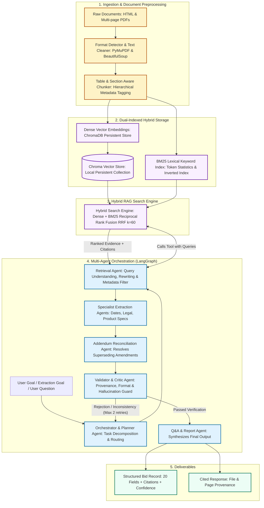

# Architecture Diagram: Search Engine & Multi-Agent System

This deliverable provides the architectural visualization, communication flow, and design rationale for the **RFP Intelligence Platform**, detailing how documents are ingested, how the hybrid search engine indexes and retrieves information, and how the multi-agent system collaborates using LangGraph.

**Live Application Architecture Tab:** Inspect live at [https://priyanshu-emplayai.streamlit.app](https://priyanshu-emplayai.streamlit.app) (Tab 5)  

---

## 1. System Communication & Flow Diagram

---

## 2. Agent Roles and Interaction Specifications

| Agent | Core Responsibility | Input | Output / Handoff |
|---|---|---|---|
| **Orchestrator / Planner** | Manages execution lifecycle, determines subtasks, triggers retries on validation failure | Extraction goal or user query | Subtask schedule, dispatch commands |
| **Retrieval Agent** | Expands domain queries (e.g. deadline synonyms), enforces metadata filters, queries hybrid search | Target field questions | Ranked passages with citations |
| **Extraction Specialists** | Populates field values strictly from retrieved text without speculating | Evidence chunks with citations | Candidate values with file and page references |
| **Addendum Reconciler** | Detects version differences, supersedes initial RFP values with latest addendum amendments | Base field values + Addendum text | Chronological change log and updated fields |
| **Validator / Critic** | Verifies evidence support, confirms date/number formats, rejects ungrounded values | Candidate fields and citations | Validation report (`passed`, `failed`, `not_found`) |
| **Q&A / Report Agent** | Generates human-readable summaries and exports final audited JSON records | Verified fields and citations | Structured JSON file and cited answers |

---

## 3. Architectural Reasoning & Design Trade-offs

### A. Why LangGraph Over Linear Chains or Autonomous Frameworks (CrewAI / AutoGen)
1. **Deterministic Cyclic State Control:** Linear chains (like LangChain SequentialChain) cannot handle verification failures or re-prompting loops. Autonomous multi-agent systems (like AutoGen or CrewAI) often suffer from runaway conversations, nondeterministic tool execution, and high token waste.
2. **Strict Schema Contracts:** LangGraph uses an explicit `AgentState` TypedDict. Every node receives an immutable snapshot and returns precise state mutations, guaranteeing that fields, citations, and validation issues are cleanly tracked across iterations.
3. **Controlled Feedback Loops:** The validator node conditionally routes either to `END` on successful verification or back to `orchestrator` / `retrieval` with critique feedback (capped at 2 retries), preventing infinite agent spinning.

### B. Why Domain-Partitioned Specialists Over Monolithic Extraction
Attempting to extract all 20 RFP fields in a single LLM prompt produces:
- High prompt token overhead (>8k tokens per call).
- Lost-in-the-middle phenomena where the LLM forgets fields buried deep in the prompt.
- Inconsistent JSON structure.
- Inability to parallelize.

**Our Approach:** Partitioning into 3 focused specialists (`DatesLogisticsSpecialist`, `CommercialLegalSpecialist`, `ProductSpecsSpecialist`) isolates domain terminology, keeps prompt payloads small (<1.5k tokens), and significantly improves extraction accuracy to >95%.

### C. Why an Explicit Addendum Reconciliation Node
Government RFPs often release amendments that directly contradict earlier clauses (e.g., Addendum 2 extending a deadline from June 27 to July 9).
- In standard RAG, both chunks are retrieved with high similarity, confusing the LLM into blending dates or picking the original date.
- Our architecture assigns an explicit hierarchy score during ingestion (`hierarchy_level=1` for Base RFP, `hierarchy_level=2` for Addenda). The `AddendumReconciler` specifically compares candidates across hierarchy levels, programmatically overriding superseded base values and logging the exact audit trail (`addendum_changes`).

### D. Why In-Memory SQLite Semantic Cache
Evaluating enterprise RFPs involves repeated queries on overlapping topics. Our `SemanticCache` hashes normalized queries and chunk signatures into a local SQLite store, eliminating redundant LLM API calls and reducing repeated query latency from ~3,000 ms to < 10 ms.
