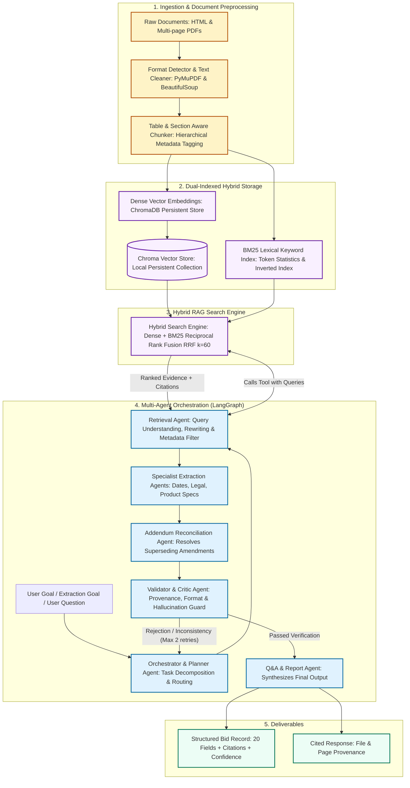

# System Architecture & Technical Specification

This document details the engineering architecture of the **RFP Intelligence Platform**, directly implementing the pipeline specified in the Emplay AI assignment.

**Live Cloud Deployment:** [https://priyanshu-emplayai.streamlit.app](https://priyanshu-emplayai.streamlit.app)  

---

## 1. System Communication & Flow Diagram

---

## 2. Component Responsibilities

1. **Ingestion & Parsing (`rfp_intelligence.ingestion`)**:
   - Parses HTML portal pages and multi-page PDFs using PyMuPDF and BeautifulSoup.
   - Extracts tables and normalizes whitespace, headers, and footers.
   - Attaches provenance metadata (`bid_id`, `file_name`, `doc_type`, `addendum_number`, `page_number`, `hierarchy_level`).

2. **Dual-Indexed Hybrid Search Engine (`rfp_intelligence.search`)**:
   - Indexes text chunks into Chroma (dense vectors) and BM25 (sparse keyword index).
   - Merges results via Reciprocal Rank Fusion ($k=60$) and applies metadata filtering.
   - Provides exact file provenance and page number citations.
   - Performs balanced cross-bid partitioning for comparative queries.

3. **Multi-Agent Orchestrator (`rfp_intelligence.agents`)**:
   - Managed with LangGraph StateGraph holding shared `AgentState`.
   - **Orchestrator**: Decomposes user goal into subtasks and handles retry routing.
   - **Retrieval Agent**: Formulates queries, calls hybrid search, filters results.
   - **Specialist Extraction Agents**: Extract target fields strictly from evidence without speculation.
   - **Addendum Reconciliation Agent**: Resolves base RFP terms against addenda via chronological hierarchy.
   - **Validator / Critic Agent**: Ensures every value is grounded, correctly formatted, and verified against citations before approval.
   - **Q&A / Report Agent**: Synthesizes natural-language answers backed by source citations.

4. **Strategic Decision & Qualification Agents**:
   - **BidComparisonAgent (`comparison.py`)**: Renders side-by-side matrices across multiple bids.
   - **GoNoGoAgent (`gonogo.py`)**: Evaluates bid requirements against corporate capabilities profile and emits strategic qualification scores.
