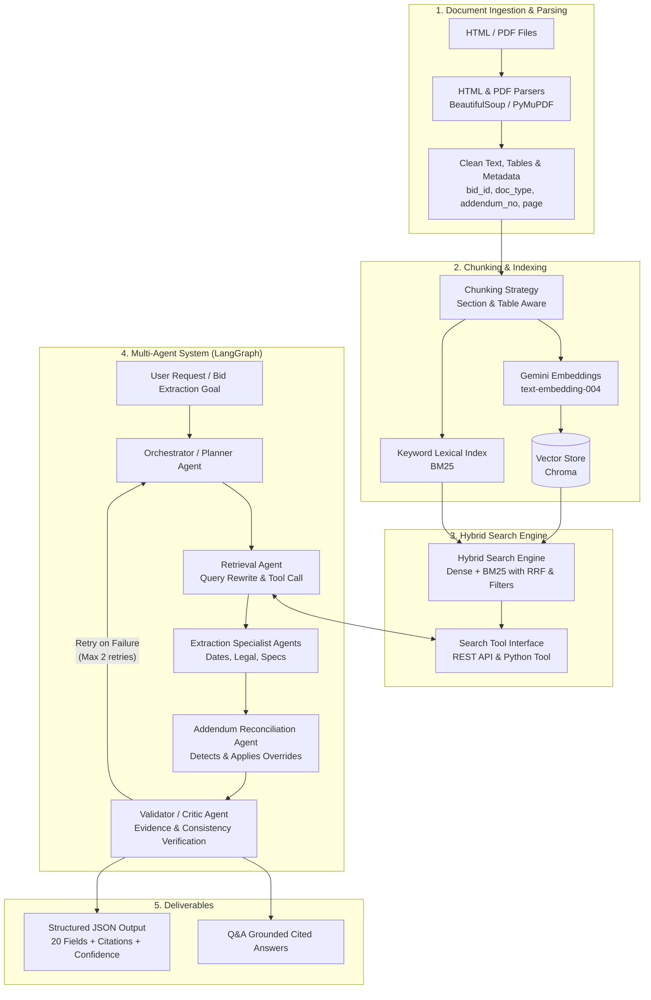

# Architecture Specification

This document illustrates the high-level architecture of the **RFP Intelligence Platform**, directly implementing the pipeline specified in the assignment.

## Pipeline Architecture

## Component Responsibilities

1. **Ingestion & Parsing (`rfp_intelligence.ingestion`)**:
   - Parses HTML portal pages and multi-page PDFs.
   - Extracts tables and normalizes whitespace, headers, and footers.
   - Attaches provenance metadata (`bid_id`, `file_name`, `doc_type`, `addendum_number`, `page_number`).

2. **Hybrid Search Engine (`rfp_intelligence.search`)**:
   - Indexes text chunks into Chroma (dense vectors) and BM25 (sparse keyword index).
   - Merges results via Reciprocal Rank Fusion (RRF) and supports metadata filtering.
   - Provides citations with file provenance and page numbers.

3. **Multi-Agent Orchestrator (`rfp_intelligence.agents`)**:
   - Managed with LangGraph StateGraph holding shared `AgentState`.
   - **Orchestrator**: Decomposes user goal into subtasks.
   - **Retrieval Agent**: Formulates queries, calls hybrid search, filters results.
   - **Extraction Agents**: Populate target fields strictly from evidence.
   - **Addendum Reconciliation Agent**: Resolves base RFP terms against addendums.
   - **Validator / Critic Agent**: Ensures every value is grounded, correctly formatted, and verified against citations before approval.
   - **Q&A / Report Agent**: Synthesizes natural-language answers backed by source citations.
